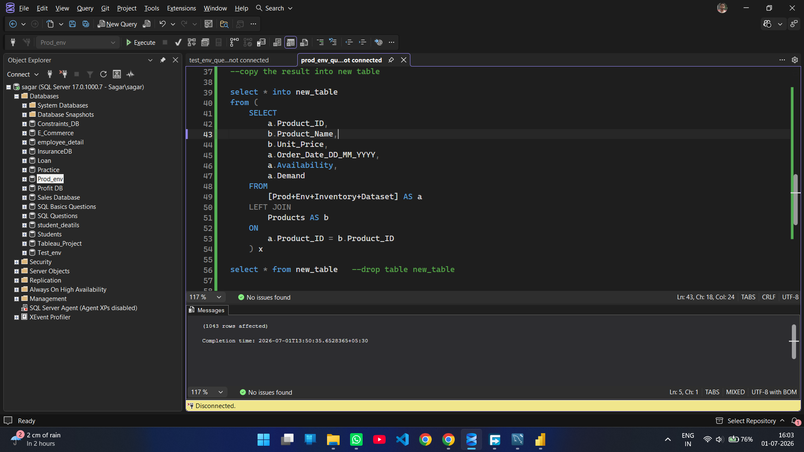
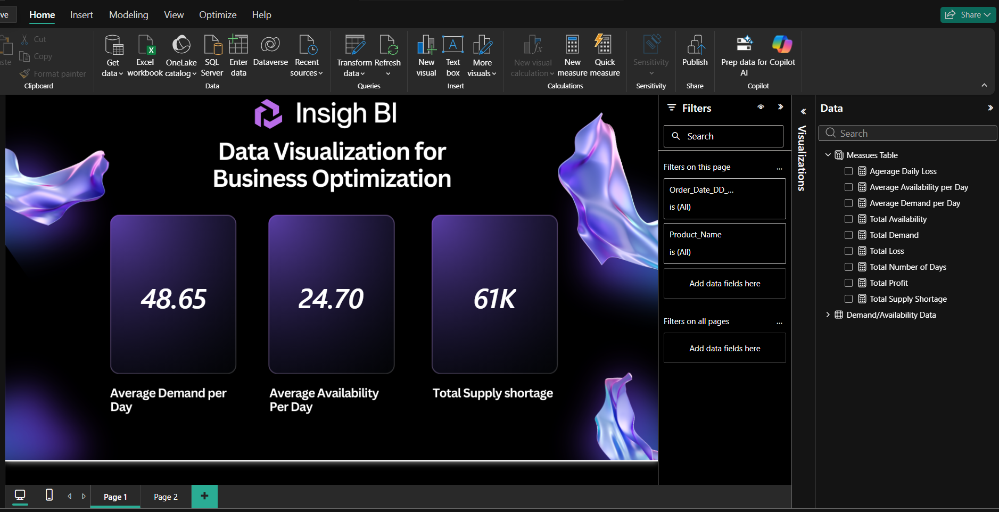
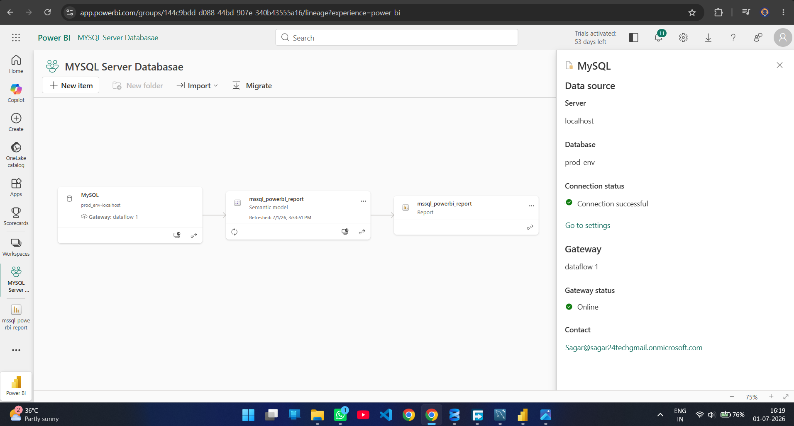

# SQL Server to MySQL Power BI Migration

An end-to-end Business Intelligence project demonstrating how a Power BI report can be migrated from **SQL Server** to **MySQL** while maintaining the same reporting layer.

The project follows a practical workflow commonly used in organizations, including separate **Test** and **Production** environments, data preparation, database migration, Power BI data source transition, and deployment to **Power BI Service** with scheduled refresh.

---

# Project Overview

This project demonstrates the following workflow:

- Import raw inventory data into a **SQL Server Test Environment**
- Clean and transform data using SQL
- Create a **Production Environment** with a larger dataset
- Update the existing Power BI report to use the Production database without rebuilding the report
- Migrate the Production database from **SQL Server** to **MySQL**
- Replace the Power BI data source using **Power Query Advanced Editor**
- Publish the report to **Power BI Service**
- Configure an **On-Premises Data Gateway**
- Enable **Scheduled Refresh**

---

# Project Workflow

```text
CSV Files
    │
    ▼
SQL Server (Test Environment)
    │
    ▼
Data Cleaning & Transformation
    │
    ▼
Power BI Desktop
    │
    ▼
SQL Server (Production Environment)
    │
    ▼
Update Existing Power BI Report
    │
    ▼
MySQL Migration
    │
    ▼
Power Query (Advanced Editor)
    │
    ▼
Power BI Service
    │
    ▼
Gateway Configuration
    │
    ▼
Scheduled Refresh
```

---

# Technologies Used

- Microsoft SQL Server
- MySQL Workbench
- Power BI Desktop
- Power Query (M Language)
- Power BI Service
- On-Premises Data Gateway

---

# Repository Structure

```
sqlserver-to-mysql-powerbi-migration
│
├── datasets/
│   ├── Test Environment Inventory Dataset.csv
│   ├── Production Environment Inventory Dataset.csv
│   └── Products.csv
│
├── sql_queries/
│   ├── test_env_query.sql
│   └── prod_env_query.sql
│
├── screenshots/
│
├── sql_powerbi_report.pbix
│
└── README.md
```

---

# Screenshots

## SQL Server - Production Environment




---

## Power BI Desktop




---

## Scheduled Refresh



---


# Implementation Steps

## 1. Test Environment Setup

- Imported raw inventory data into SQL Server.
- Prepared reporting data using SQL transformations and joins.
- Connected Power BI Desktop to the Test database.

---

## 2. Production Environment

- Created a separate Production database with a larger dataset.
- Updated the existing Power BI report to point to the Production database by changing the data source configuration.
- Reused the same report without rebuilding visuals or DAX measures.

---

## 3. SQL Server to MySQL Migration

- Recreated the Production database schema in MySQL.
- Converted SQL Server queries to MySQL syntax while preserving the schema.
- Imported the production data into MySQL.

---

## 4. Power BI Data Source Migration

- Updated the Power Query source using the **Advanced Editor**.
- Successfully switched the report from SQL Server to MySQL.
- Verified that all visuals and DAX measures continued to work correctly after migration.

---

## 5. Deployment

- Published the report to Power BI Service.
- Configured an On-Premises Data Gateway.
- Enabled Scheduled Refresh to keep the report synchronized with the MySQL database.

---


# Skills Demonstrated

- SQL Data Cleaning
- SQL Joins
- Database Migration
- SQL Server
- MySQL
- Power BI
- Power Query
- Power BI Service
- Data Source Migration
- On-Premises Gateway
- Scheduled Refresh
- Business Intelligence Deployment

---

# Key Learning Outcomes

- Working with separate Test and Production environments
- Reusing an existing Power BI report after changing the data source
- Migrating reporting databases between SQL Server and MySQL
- Updating Power Query source code using the Advanced Editor
- Deploying reports to Power BI Service
- Configuring Gateway and Scheduled Refresh for automated reporting

---
