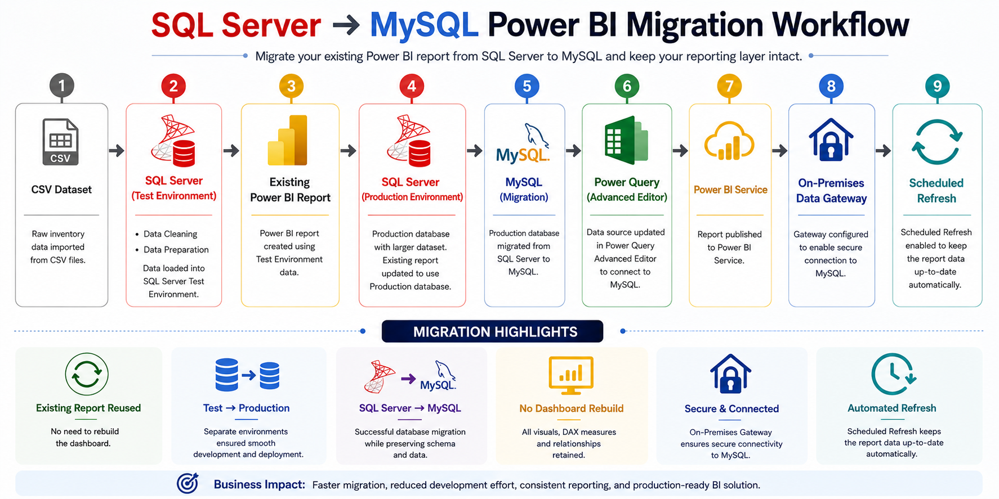
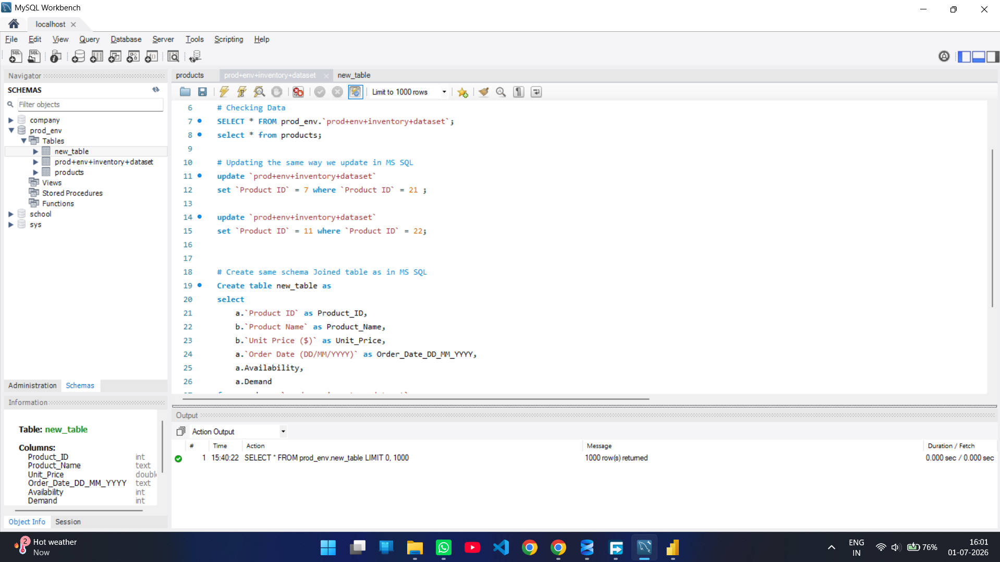
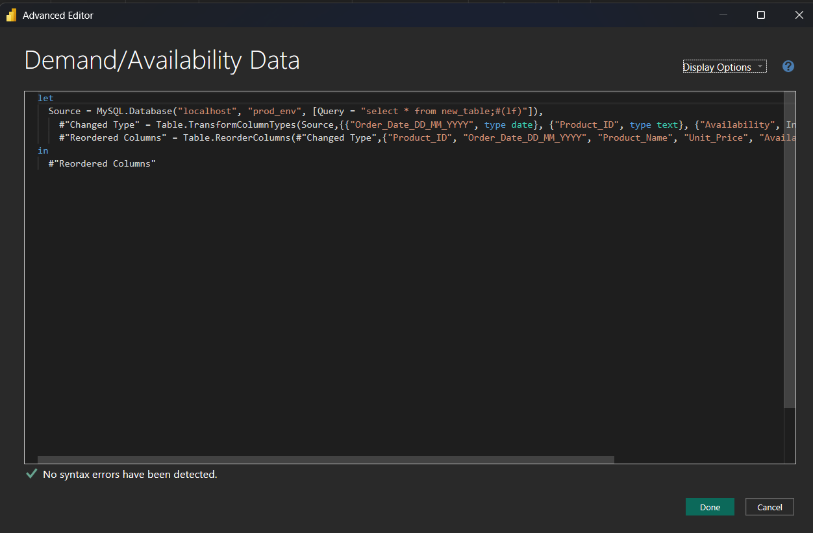

# SQL Server → MySQL Power BI Migration

An enterprise-style Business Intelligence project demonstrating the migration of an existing Power BI reporting solution from **SQL Server** to **MySQL** while preserving the reporting layer, business logic, and dashboard functionality.

The project follows a real-world migration workflow involving **Test & Production environments**, **SQL data transformation**, **Power Query Advanced Editor**, **Power BI Service deployment**, **On-Premises Gateway**, and **Scheduled Refresh**.

---

## 🛠 Tech Stack

<p align="left">


</p>

---

# Migration Workflow



---

# Project Overview

This project simulates a real enterprise database migration where an existing Power BI reporting solution is transitioned from **SQL Server** to **MySQL** without rebuilding reports.

Instead of recreating dashboards or DAX calculations, the existing report is reused by migrating the underlying database and updating only the data source configuration using **Power Query Advanced Editor**.

The final solution is deployed to Power BI Service with an **On-Premises Data Gateway** and **Scheduled Refresh**, closely matching production BI environments.

---

# Business Problem

Organizations frequently migrate operational databases due to licensing costs, cloud adoption, infrastructure modernization, or technology standardization.

During database migration, rebuilding dashboards from scratch increases:

- Development effort
- Project cost
- Testing time
- Deployment risk

An efficient migration strategy should preserve existing reports while only replacing the underlying data source.

---

# Solution

This project demonstrates a production-style migration strategy.

The workflow includes:

- Building reports using SQL Server Test Environment
- Preparing Production Environment
- Migrating Production Database to MySQL
- Updating Power BI data source using Power Query Advanced Editor
- Validating all visuals and DAX calculations
- Deploying the migrated report to Power BI Service
- Configuring Gateway and Scheduled Refresh

---


# Business Benefits

This migration approach provides:

- Reusable reporting layer
- Reduced development effort
- Faster migration
- Consistent business logic
- Easier maintenance
- Lower deployment risk
- Production-ready reporting pipeline

---

# Technology Overview

| Category | Technology |
|------------|------------|
| Database | SQL Server |
| Production Database | MySQL |
| Query Language | SQL |
| Data Source Migration | Power Query (M Language) |
| Visualization | Power BI Desktop |
| Deployment | Power BI Service |
| Connectivity | On-Premises Gateway |
| Automation | Scheduled Refresh |

---

# Project Screenshots

## SQL Server Production Environment


---

## SQL Server to Power BI Connection


---

## MySQL Production Database



---

## Power Query Advanced Editor



---

## Power BI Dashboard


---

## Scheduled Refresh


---

# Project Highlights

- Enterprise-style Database Migration
- SQL Server Test Environment
- SQL Server Production Environment
- SQL Server → MySQL Migration
- Power Query Advanced Editor
- Data Source Transition
- Existing Report Reusability
- Power BI Service Deployment
- On-Premises Gateway Configuration
- Automated Scheduled Refresh

---

# SQL Concepts Applied

- SQL Joins
- Data Cleaning
- Data Transformation
- Production Database Preparation
- Database Migration
- Query Optimization

---

# Power BI Concepts Applied

- Power BI Desktop
- Power Query
- Advanced Editor
- Data Source Replacement
- DAX Measures
- Report Publishing
- Power BI Service
- Scheduled Refresh

---

# Power Query Migration

Instead of rebuilding the report, the migration was completed by modifying the Power Query source connection through the **Advanced Editor**.

This approach preserved:

- Existing visuals
- Existing DAX measures
- Existing relationships
- Existing report pages

while seamlessly switching the underlying database from SQL Server to MySQL.

---

# Technical Skills Applied

### Database Engineering

- SQL Server
- MySQL
- Database Migration
- Test & Production Environments

### Data Transformation

- SQL Cleaning
- SQL Joins
- Query Optimization

### Business Intelligence

- Power BI
- DAX
- Power Query
- Dashboard Development

### Deployment

- Power BI Service
- On-Premises Gateway
- Scheduled Refresh

---

# Repository Structure

```text
sqlserver-mysql-powerbi-migration
│
├── datasets
│   ├── Test Environment Inventory Dataset.csv
│   ├── Production Environment Inventory Dataset.csv
│   └── Products.csv
│
├── sql_queries
│   ├── test_env_query.sql
│   └── prod_env_query.sql
│
├── screenshots
│   ├── migration_workflow.png
│   ├── ms_sql.png
│   ├── sql_to_powerbi_loading_data.png
│   ├── my_sql.png
│   ├── advanced_editor.png
│   ├── dax_functions.png
│   └── powerbi_scheduled_refresh.png
│
├── sql_powerbi_report.pbix
└── README.md
```

---

# Future Enhancements

- Incremental Refresh
- Row-Level Security (RLS)
- Parameterized Database Connections
- Deployment Pipelines
- CI/CD Integration

---

# Author

**Sagar Bairwa**

📧 Email: sagar.bairwa.tech@gmail.com

💼 LinkedIn: https://linkedin.com/in/sagarbairwa

💻 GitHub: https://github.com/sagar-bairwa

---

⭐ If you found this project helpful, consider giving it a Star.
